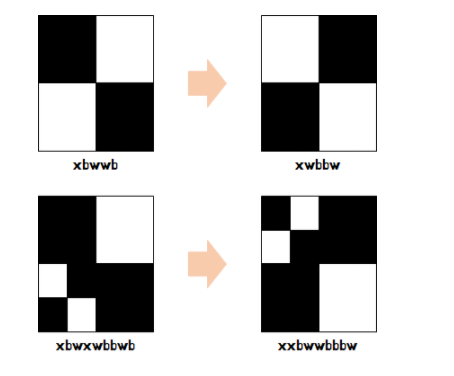
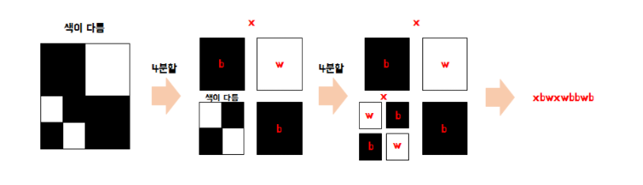

# 8.9 - 8.15 homework

★ **8.15 18:00까지 제출**

## 1. 이진 변환 반복하기 (프로그래머스 :  월간 코드 챌린지 시즌 1)

```python
def solution(s):
    answer = [0,0]
    z_cnt = 0

    while s != '1': # 이진 변환을 위해 1이 나올 때까지 반복
        len_s = 0     
        
        for i in s:
            if i == '0':
                z_cnt += 1
        
        s = s.replace('0', "")
        len_s += len(s)
        s = str(format(len_s, 'b'))

        answer[0] += 1

    answer[1] = z_cnt
    return answer
```


## 2. 쿼드 압축 후 개수 세기 (프로그래머스 :  월간 코드 챌린지 시즌 1)

```python
# 재귀함수 사용
# 네개의 숫자를 비교한 후 전부 같으면 0or 1ㄹ로 변경하면 되는데
# 숫자를 비교해서 같지 않으면 나눈다.
# 그리고 해당 함수를 재귀함수로 사용해서 들어오는 배열 수에 맞춰서 반복적으로 나눈다.

def solution(arr):
    for i in arr:
        for j in arr[i]:

            number = arr[i][j]

            for x in range(i, i+n):
                for y in range(j, j+n):
                    if number != arr[x][y]:


```


## 3. 스타 수열 (프로그래머스 :  월간 코드 챌린지 시즌 1)

```python
# max를 사용해서 가장 빈도가 높은 원소를 뽑아낸다
# 처음에는 가장 빈도가 높은 수를 뽑아서 최대 원소 수가 나오는 경우만 찾으면 된다고 생각함
# 문제 이해가 정확하지 않음
```


## 4. 다음의 개념에 대해 탐구하고 설명하시오.

### 4-1. 시간 복잡도의 개념에 대해 탐구하시오.

```bash
1. 알고리즘의 성능을 설명하는 것이다.
2. 알고리즘을 수행하기 위해 프로세스가 수행해야하는 연산을 수치화한 것
3. 실행 시간이 아닌 연산 수치로 표기하는 이뉴는, 실행 시간은 컴퓨터의 하드웨어 또는 언어에 따라 편차가 크게 달라지기 때문에 실행 횟수만을 고려함

Big-O 표기법
- 알고리즘 실행 시간의 상한선을 나타낸 표기법
O(1) : 상수 - 입력과 관계없이 복잡도가 동일
O(N) : 선형 - 입력이 증가함에 따라 처리 시간이 선형적으로 증가
O(N^2) : square - 반복문이 두 번 있는 경우
O(log n) : 입력 크기에 따라 처리 시간이 증가하는 정렬 알고리즘에 주로 사용
O(2^n) : 지수 시간 - 입력 데이터의 크기에 따라 걸리는 시간이 2^n 만큼 비례
				- 모든 조합과 방법을 시도할 때 사용
				- 피보나치 수열
```


### 4-2. 분할 정복에 대해 병합정렬과 퀵 정렬의 예시를 들어 설명하시오. (설명 시 시간 복잡도에 대해 필히 기입하시오.)

```bash
분할정복
- 기본적으로 엄청 크고 방대한 문제를 조금씩 나눠가면서 용이하게 풀 수 있는 문제 단이로 나눈 다음 다시 합쳐서 해결하는 과정

과정
1. 분할 : 문제 분할이 가능한 경우  2개 이상의 문제로 나눈다.
2. 정복 : 나누어진 문제가 여전히 분할이 가능하면, 다시 분할을 수행한다.
3. 결합 : 결합하여 문제 답을 얻는다.

병합 정렬(Merge Sort)
-  주어진 수열을 가운데에서 나누어 비슷한 크기의 수열 두개로 만든 뒤 이들을 재귀 호출을 이용해 각각 정렬하고 정렬된 배열을 하나로 합친다.
- # 쿼드 트리 뒤집기?? : 박스를 나눈 뒤 재귀 호출을 이용해서 정렬된 배열을 하나로 합친다???
병합 정렬의 시간 복잡도 : O(nlogn)

퀵 정렬
- 불안정 정렬에 속하며, 다른 원소와의 비교만으로 정렬을 수행하는 비교정렬이다.
- 매우 빠른 수행 속도
- 합병 정렬과 달리 리스트를 비균등하게 분할한다.
- 퀵 정렬 단계
	1. 분할 : 입력 배열을 피벗을 기준으로 비균등하게 2개의 부분 배열(피벗을 중심으로 왼쪽: 피벗보다 작은 			요소들, 오른쪽: 피벗보다 큰 요소들)로 분할
	2. 정복 : 부분 배열을 정렬한다. 부분 배열의 크기가 충분히 작지 않으면 순환 호출 을 이용하여 다시 분할 				정복 방법을 적용
	3. 결합 : 하나의 배열에 합병
```


## 5. 쿼드 트리 뒤집기

[쿼드 트리 뒤집기 문제](https://algospot.com/judge/problem/read/QUADTREE) : 이 문제는 4번과 관련되어 푸시오.

```python
# b가 검은색 w가 흰색
# 입력값 C는 상하 반전 횟수
# 네칸으로 생각했을 때 반전하면, xbwwb -> xwbbw 이렇게 형성된다.

# 사각형을 4분할해서 분할된 사각형을 다시 재귀호출하고 전체 사각형 색이 같은지 확인
# 사각형이 4분할이 가능할 때까지 4분할 하는 함수를 재귀 함수로 사용한다.

4
w
xbwwb
xbwxwbbwb
xxwwwbxwxwbbbwwxxxwwbbbwwwwbb 


```





문제 이해가 잘 되지 않아 다음 그림을 참고함.
