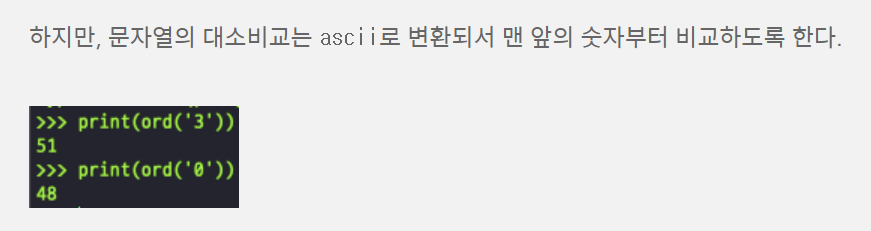

# 9.6 - 9.12 homework

★ **9.13 스터디 전까지 제출**

★ 이번 과제는 추후 일정에 따라 제출 일정이 변경될 수 있음 


## 1. K번째 수 (프로그래머스 : 코딩테스트 연습 -> 코딩 테스트 고득점 Kit -> 정렬)

```python
def solution(array, commands):
    answer = []

    for i in range(len(commands)):                              # 리스트 초기화 때문에, 범위로 지정
        array = array                                           # 리스트는 바뀌니까 늘 초기화 필요
        target_array = array[commands[i][0]-1:commands[i][1]]   # 시작, 끝 주고
        target_array = sorted(target_array)                     # 정렬 한번 하고
        answer.append(target_array[commands[i][2]-1])           # 해당 숫자만 삽입

    return answer
```


## 2. 가장 큰 수 (프로그래머스 : 코딩테스트 연습 -> 코딩 테스트 고득점 Kit -> 정렬)

```python
def solution(numbers):
    numbers = list(map(str, numbers))
    numbers.sort(key=lambda x: x*3, reverse=True)   # 사진 참조
    # 221과 2의 비교 : 221 2 / 221221 22 / 221221221 222(여기서 2가!)
    
    return str(int(''.join(numbers)))   # 000이런거 0만들기 위해 int!

print(solution([6, 10, 2]))
print(solution([3, 30, 34, 5, 9]))
```




## 3. H-Index (프로그래머스 : 코딩테스트 연습 -> 코딩 테스트 고득점 Kit -> 정렬)

```python
def solution(citations):
    answer = 0

    for i in range(len(citations), 0, -1):  # 최대값을 구하기 위해 길이부터 시작 
        cnt = 0                             # 갯수를 비교하기 위해
        for j in citations:
            if j >= i:                      # 예를 들어 3이상인거 구할 때 3,4,5는
                cnt += 1                    # 갯수 +=1
        if cnt >= i:                        # 중요! : H-index의 의미, 3이상인 총갯수가 3이아니라! 3이상인가?!
            answer += i
            break
    
    return answer
```


## 4. 단어 변환 (프로그래머스 : 코딩테스트 연습 -> 코딩 테스트 고득점 Kit -> 깊이/너비 우선 탐색)

```python
# DFS! (답 안나옴!...)

def solution(begin, target, words):
    answer = 0
    stack = []

    if target not in words:     # target이 words에 없으면 변환해서 절대 안나오니까
        return 0

    stack.append(begin)         # 시작을 담고

    while stack:
        for i in (0, len(words)):
            cnt = 0             # 글자 다른 갯수
            for j in range(0, len(begin)):
                if stack[-1][j] != words[i][j]: # 글자가 다르면
                    cnt += 1

                if cnt > 1:     # 1개 넘게 다르면 볼 필요 X
                    break

            if cnt == 1:        # 1개만 다르면
                stack.append(words[i])  # stack에 추가
                answer += 1             # 횟수 1증가

            if stack[-1] == target: # target 도달 시 출력
                return answer
```


## 5. 여행경로 (프로그래머스 : 코딩테스트 연습 -> 코딩 테스트 고득점 Kit -> 깊이/너비 우선 탐색)

```python
# DFS!

def solution(tickets):
    answer = []
    stack = ['ICN']     # 무조건 인천 시작
    dict = {}           # 딕셔너리 느낌으로 하면 출-도 형태 / 시간단축?!

    for ticket in tickets:
        if ticket[0] in dict:
            dict[ticket[0]].append(ticket[1])
        else:
            dict[ticket[0]] = [ticket[1]]       # 리스트로 해야만 추가가 됨

    '''
    {'ICN': ['JFK'], 'HND': ['IAD'], 'JFK': ['HND']}
    {'ICN': ['SFO', 'ATL'], 'SFO': ['ATL'], 'ATL': ['ICN', 'SFO']}
    '''

    # 도움을 얻은 Point (pop이 뒤에서부터 빼오니까)
    for i in dict:
        dict[i].sort(reverse=True)

    while stack:
        top = stack[-1] # stack으로부터 찾아나서기

        if top in dict and len(dict[top]) != 0: # 해당하고, 도착지 선택지가 있다면!
            stack.append(dict[top].pop())       # 빼서 스택에 담고!

        else:
            answer.append(stack.pop())          # 없으면 정답 경로에 스택을 빼서 담음!

    return  answer[::-1]        # 도움을 얻은 Point (stack에서 역순으로 답에 집어넣으니까)
```


## 6. 체육복 (프로그래머스 : 코딩테스트 연습 -> 코딩 테스트 고득점 Kit -> 탐욕법)

```python
def solution(n, lost, reserve):
   
    set_reserve = set(reserve) - set(lost)  # 초기세팅
    set_lost = set(lost) - set(reserve)     # 여분있어도 강탈당하면 둘다 제거!

    for i in set_reserve:               # 여분친구들
        if i-1 in set_lost:             # 앞번호
            set_lost.remove(i-1)
        elif i+1 in set_lost:           # 뒷번호
            set_lost.remove(i+1)
    return n-len(set_lost)              # 전체에서 그래도 참가못하는 제거
```


## 7. 조이스틱 (프로그래머스 : 코딩테스트 연습 -> 코딩 테스트 고득점 Kit -> 탐욕법)

```python
def solution(name):
    joystick = []
    for i in name:  # 최소 거리 저장 (아스키 코드 / 좌우 그 중간 지점이 있음 90~65)
        joystick.append(min(ord(i) - ord('A'), ord('Z') - ord(i) + 1))
    
    # print(joystick)
    
    i, answer = 0, 0
    while True:                     # 좌우 탐색 확인
        answer += joystick[i] 
        joystick[i] = 0             # 더해주면 0으로 제거
        
        if sum(joystick) == 0:      # 완료되면 출력
            return answer
        
        left, right = 1, 1          # 좌우 탐색
        
        while joystick[i - left] == 0:  # 좌는 인덱스 감소 ('A'가 나오면!)
            left += 1

        while joystick[i + right] == 0: # 우는 인덱스 증가 ('A'가 나오면!)
            right += 1
        
        if right > left:                # 'A'가 나온게 우측이면
            answer += left              # 왼쪽으로 진행하는게 이득
            i -= left                   # 왼쪽으로 계속 진행
        else:                           # 반대!
            answer += right
            i += right
```

