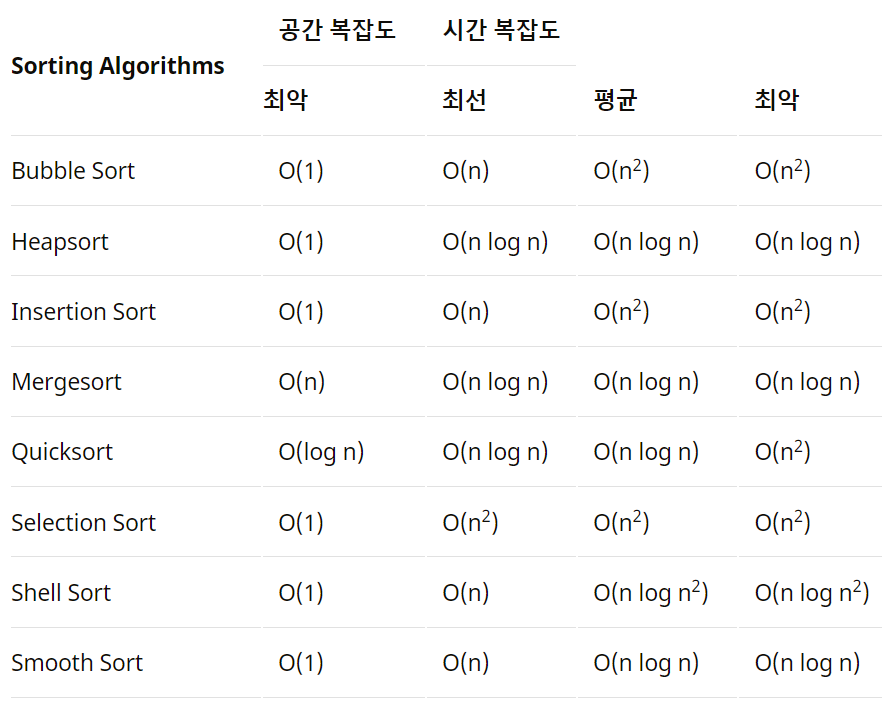

# 8.9 - 8.15 homework

★ **8.15 18:00까지 제출**

## 1. 이진 변환 반복하기 (프로그래머스 :  월간 코드 챌린지 시즌 1)

```python
def solution(s):
    bin_cnt = 0 # 2진 변환 카운팅
    zero_cnt = 0 # 0 제거 카운팅
    
    while s != '1':
        if '0' in s: # 0이 있다면
            result = 0 # 0 숫자 카운팅
            for i in s:
                if i == '0':
                    result += 1
            s = '1' * (len(s) - result) # 1의 개수를 구해서 다시 만듬
            zero_cnt += result

        s = format(len(s), 'b') # 2진 변환(어차피 길이 -> 2진 변환해야하므로 종료 조건을 걸 필요 없음)
        bin_cnt += 1
        
    return [bin_cnt, zero_cnt]
```


## 2. 쿼드 압축 후 개수 세기 (프로그래머스 :  월간 코드 챌린지 시즌 1)

```python
# 방법1.
def solution(arr):
    zero = 0 # 0을 카운트
    own = 0 # 1을 카운트
    
    def alzip(arr, N):
        nonlocal zero, own
        if N == 1: # base case
            if arr[0][0]: # 1인 경우
                own += 1
            else: # 0인 경우
                zero += 1
            return
        elif sum(sum(arr, [])) == 0 or sum(sum(arr, [])) == N**2: # 블럭이 같은 값인 경우
            if sum(sum(arr, [])): # 0인 경우
                own += 1
            else: # 1인 경우
                zero += 1
            return
            
        new_arr1 = []
        new_arr2 = []
        new_arr3 = []
        new_arr4 = []
        for i in range(N): # 4개로 분리
            if i < N//2:
                new_arr1.append(arr[i][:N//2])
                new_arr2.append(arr[i][N//2:])
            else:
                new_arr3.append(arr[i][:N//2])
                new_arr4.append(arr[i][N//2:])
                
        alzip(new_arr1, N//2) # 재귀
        alzip(new_arr2, N//2)
        alzip(new_arr3, N//2)
        alzip(new_arr4, N//2)
    
    alzip(arr, len(arr))
    return [zero, own]

# 방법2(다른 사람 풀이 참고)
def solution(arr):
    result = [0, 0] # 0, 1의 개수(리스트 요소는 함수에서 수정 가능하므로 리스트로 저장)

    def alzip(x, y, size):
        if size == 1: # base case
            result[arr[x][y]] += 1 # 해당 좌표의 값(인덱스) +1
            return
        else:
            confirm = arr[x][y] # 확인용 변수

            for dx in range(size):
                for dy in range(size):
                    if confirm != arr[x+dx][y+dy]: # dx, dy를 더해주는 방향으로 가야됨(왜냐면 x, y를 매개변수로 쓰므로)
                        alzip(x, y, size//2)
                        alzip(x + size//2, y, size//2)
                        alzip(x, y + size//2, size//2)
                        alzip(x + size//2, y + size//2, size//2)
                        return
            result[confirm] += 1 # 만약, for문 전체를 돌았다면 confirm(인덱스) +1(모두 같은 값인 경우)
    alzip(0, 0, len(arr))
    return result
```


## 3. 스타 수열 (프로그래머스 :  월간 코드 챌린지 시즌 1)

```python
def solution(arr):
    length = len(arr)
    counting = [[0, None] for _ in range(length+1)] # 카운팅할 2차원 리스트(인덱스: arr 요소의 숫자, [0, None]: 0 자리는 카운팅/None 자리는 어느 인덱스와 연결해서 카운팅했는지)
    confirm = [False] * (length+1) # 카운팅 했는지 체크할 리스트(인덱스: arr의 인덱스, Fasle: 카운팅 안함)

    for i in range(1, length): # 0은 인덱스상 돌면 안됨(1부터!)
        if arr[i-1] != arr[i]: # 다른 경우
            if counting[arr[i-1]][1] != i and not confirm[i-1]: # arr[i-1]의 값과 같은 숫자가 같은 인덱스와 연결해서 카운팅하지 않고, i-1번째 인덱스가 카운팅 안된 경우
                counting[arr[i-1]][0] += 1 # 카운팅 +1
                counting[arr[i-1]][1] = i # 연결 인덱스 변경
                confirm[i-1] = True # 카운팅 한 것으로 변경
            if counting[arr[i]][1] != i-1 and not confirm[i]: # 위의 i-1 작업과 같음
                counting[arr[i]][0] += 1
                counting[arr[i]][1] = i-1
                confirm[i] = True

    return max(counting)[0]*2 # 2차원 리스트이므로 튜플 형태로 max 출력됨(0번째 인덱스가 카운팅이므로 이 값의 2배를 반환해줌)
```


## 4. 다음의 개념에 대해 탐구하고 설명하시오.

### 4-1. 시간 복잡도의 개념에 대해 탐구하시오.

```bash
시간 복잡도란 문제를 해결하는데 걸리는 시간과 입력의 함수 관계를 의미한다.
- 쉽게 의미하면 알고리즘의 성능을 설명하는 것

종류
- 최상의 경우 : 오메가 표기법 (Big-Ω Notation)
- 평균의 경우 : 세타 표기법 (Big-θ Notation)
- 최악의 경우 : 빅오 표기법 (Big-O Notation)

시간 복잡도 구하기 요령
- 하나의 루프를 사용하여 단일 요소 집합을 반복 하는 경우 : O (n)
- 컬렉션의 절반 이상 을 반복 하는 경우 : O (n / 2) -> O (n)
- 두 개의 다른 루프를 사용하여 두 개의 개별 콜렉션을 반복 할 경우 : O (n + m) -> O (n)
- 두 개의 중첩 루프를 사용하여 단일 컬렉션을 반복하는 경우 : O (n²)
- 두 개의 중첩 루프를 사용하여 두 개의 다른 콜렉션을 반복 할 경우 : O (n * m) -> O (n²)
- 컬렉션 정렬을 사용하는 경우 : O(n*log(n))
```


### 4-2. 분할 정복에 대해 병합정렬과 퀵 정렬의 예시를 들어 설명하시오. (설명 시 시간 복잡도에 대해 필히 기입하시오.)

```bash
병합정렬은 비교 기반의 정렬 알고리즘이다. 일반적인 방법으로 구현했을 때 이 정렬은 안정 정렬에 속하며, 분할 정복 알고리즘의 하나이다.

알고리즘
1. 리스트의 길이가 1 이하이면 이미 정렬된 것으로 본다. 그렇지 않은 경우에는
2. 분할(divide) : 정렬되지 않은 리스트를 절반으로 잘라 비슷한 크기의 두 부분 리스트로 나눈다.
3. 정복(conquer) : 각 부분 리스트를 재귀적으로 합병 정렬을 이용해 정렬한다.
4. 결합(combine) : 두 부분 리스트를 다시 하나의 정렬된 리스트로 합병한다. 이때 정렬 결과가 임시배열에 저장된다.
5. 복사(copy) : 임시 배열에 저장된 결과를 원래 배열에 복사한다.


퀵정렬은 기준키를 기준으로 작거나 같은 값을 지닌 데이터는 앞으로, 큰 값을 지닌 데이터는 뒤로 가도록 하여 작은 값을 갖는 데이터와 큰 값을 갖는 데이터로 분리해가며 정렬하는 방법이다.

알고리즘
1. 적당한 수(피봇, pivot)를 선택한다. 일반적으로 데이터의 총 평균값을 취한다.
2. 피봇보다 작은 수들을 피봇 앞으로, 큰 수를 뒤로 이동시킨다. (분할)
3. 두 분할된 각각의 데이터를 재귀적으로 각각 정렬한다.
4. 분할된 원소가 0개나 1개가 될 때까지 계속 재귀 호출이 반복된다
```



## 5. 쿼드 트리 뒤집기

[쿼드 트리 뒤집기 문제](https://algospot.com/judge/problem/read/QUADTREE) : 이 문제는 4번과 관련되어 푸시오.

```python
def find_mid(arr): # 좌상, 우상, 좌하, 우하의 분기를 찾는 함수
    cnt = 0 # 카운팅
    result = [] # 결과
    confirm = [False, False, False] # 중복을 방지하기 위한 리스트

    for word in range(1, len(arr)):
        if arr[word] != 'x': # x가 아닌 경우
            cnt += 1 # 카운틴
        else: # x인 경우
            cnt -= 3 # 3개의 숫자가 더 나와야 하므로 -3
        if cnt == 1 and not confirm[0]: # 좌상과 우상의 구분점을 찾았고, 
            confirm[0] = True # 기록한 것으로 바꿈
            result.append(word+1) # 결과 저장
        if cnt == 2 and not confirm[1]:
            confirm[1] = True
            result.append(word+1)
        if cnt == 3 and not confirm[2]:
            confirm[2] = True
            result.append(word+1)
    return result


def tree_reverse(arr):
    if len(arr) == 1: # arr 길이가 1인 경우
        result.append(arr[0]) # 결과에 저장
        return
    else: # arr 길이가 1이 아닌 경우
        result.append('x') # 'x' 결과에 저장(무조건 x로 시작하게 되어있음)
        second, third, fourth = find_mid(arr) # 분기점 받기

        tree_reverse(arr[third:fourth]) # 좌하(상하 뒤집히므로 가장 먼저 나와야 함)
        tree_reverse(arr[fourth:]) # 우하(두번째로 나옴)
        tree_reverse(arr[1:second]) # 좌상(세번째로 나오고, 'x'를 빼줘야 하므로 범위 1부터)
        tree_reverse(arr[second:third]) # 우상(마지막)
        

import sys

input = sys.stdin.readline
N = int(input())

for i in range(N):
    result = []
    words = input().rstrip()
    tree_reverse(words)
    print(*result, sep='')
```

